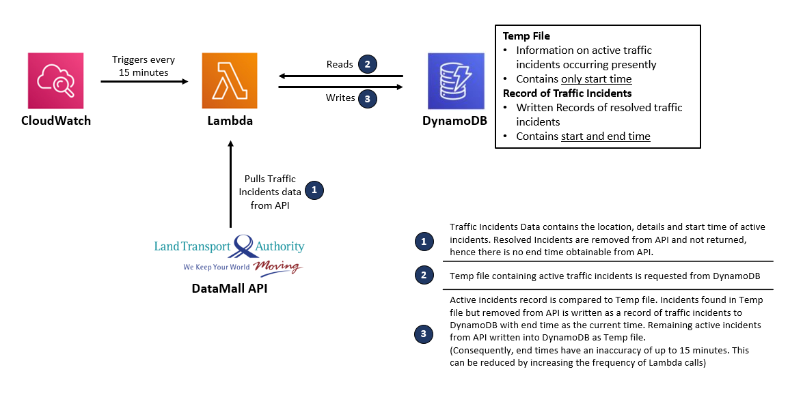

# LTA-Traffic-Incidents-Cloud-Scrapper
Project to try out AWS Lambda and DynamoDB. The app is currently deployed live on AWS and is querying the API every 15 minutes round the clock.

Largely, I tried to keep everything to the free tier of AWS services, which was why the database deployed is DynamoDB.

In an earlier iteration, I had managed to push information from the Lambda function to a telegram bot, but was removed as it served little practical use.

